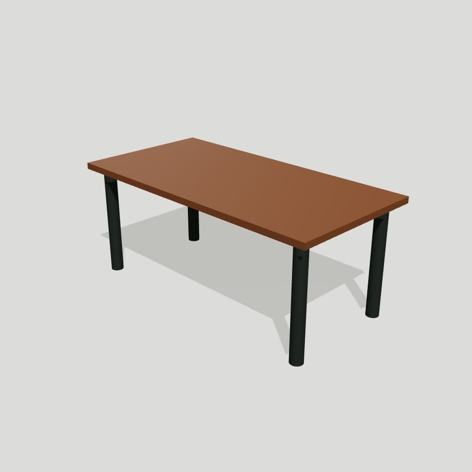

# ShowRoom 3D

A 48-hour hackathon MVP: artisans configure furniture with JSON parts; buyers
visualize finishes and order through WhatsApp. See [the team guide](docs/TEAM_GUIDE.md)
for the architecture, schema, ownership, milestone gates and exact demo story.

## What ShowRoom 3D does

Artisans do not need 3D modeling skills. They sign in, choose a furniture template,
adjust dimensions and simple parts, add finishes and prices, upload a reference
photo, and publish a product link. My products keeps their saved products together;
a private profile supplies their WhatsApp default for future drafts.

Buyers open the public link without an account, rotate the furniture, compare
finishes, see dimensions and live prices, and start an order enquiry in WhatsApp.
The message includes a configuration URL that restores the customer's selections.



| Artisan workspace | Buyer experience |
| --- | --- |
| Supabase signup/login and private profile | Public shareable product page |
| Seven templates: table, chair, shelf, bed, sofa, coffee table and desk | Touch/mouse 3D rotation |
| Numeric dimensions and box/cylinder/sphere parts | Color and texture finish selection |
| Photo/texture uploads, base price and finish modifiers | Immediate price and dimension display |
| Save product and view the account's My products | WhatsApp enquiry with preserved configuration |

**Stack:** React, Vite, TypeScript, React Three Fiber, Three.js, drei, Supabase
Database/Storage/Auth, and Vercel Functions. Templates are JSON shape descriptions,
rendered in the browser. Plain CSS keeps the interface responsive.

Shape-built furniture is a stylized approximation. There is no payment checkout,
automatic order confirmation, GLB upload or photo-to-3D generation in this release.
**Photo-to-3D is on our roadmap.**

## Get the project

Use Node.js 24 and Windows PowerShell:

```powershell
git clone https://github.com/Charles-DEV-1/Showroom_3D.git
Set-Location Showroom_3D
npm.cmd ci
Copy-Item .env.example .env.local
```

Fill the four variables in `.env.local` from your Supabase project. Apply the
migrations in `supabase/migrations/` to a new project in timestamp order; for an
existing project, check which migrations are already applied. Setup details are
below and in the milestone guides. Never commit `.env.local` or put the server
secret in a `VITE_` variable. Then run `npm.cmd run dev` and open the printed URL.

Recording handoff: [one-minute video guide](pitch/ONE_MINUTE_VIDEO_GUIDE.md).
Deployment handoff: [Milestone 15](docs/MILESTONE_15.md).

## Current checkpoint

**Features frozen on October 8, 2026, at the user's request.** Build, lint and
all 33 tests passed at the freeze. [Milestone 14](docs/MILESTONE_14.md) delegates
the remaining manual acceptance and recording; the new short video is not yet
recorded. Give the recorder [this 60-second guide](pitch/ONE_MINUTE_VIDEO_GUIDE.md)
for scenes, actions and exact narration. [Milestone 15](docs/MILESTONE_15.md) is
now uses [Charles-DEV-1/Showroom_3D](https://github.com/Charles-DEV-1/Showroom_3D)
as its GitHub delivery repository. The user will create the Vercel project after
the GitHub upload. Vercel deployment and public-site acceptance are still pending.

Milestone 13: private artisan profiles and optional builder contact defaults are
implemented. Profile and My products adapt from small phones to desktop, with
wrapping navigation, stacked fields, adaptive cards and 44 px touch targets.
The profiles migration is applied; live privacy/default checks and 320–1440 px
layout checks passed. See [Milestone 13](docs/MILESTONE_13.md) for your phone test.

Milestone 12's artisan workspace and write APIs require login, new products
belong to the verified artisan, and My products lists that account's latest 100
products. Sign-out returns to the landing page. The owner-column migration is
applied and real two-account browser/API checks passed. Your own account/phone
acceptance checklist is in [Milestone 12](docs/MILESTONE_12.md).
Simple signup/login stays within the MVP scope; there is no password recovery.
See [Milestone 11](docs/MILESTONE_11.md) for email/redirect setup.

Milestone 10's landing page and embedded demo passed local acceptance. Open
the home page to watch the narrated walkthrough, try the saved table, or enter
the builder. A small silent loop shows the actual table rotating and changing
finishes, with Pause/Play and a still poster for reduced-motion settings.
The home page loads separately from the heavier 3D pages.
Buyer demos remain public. Create furniture requires artisan sign-in.
See [Milestone 10](docs/MILESTONE_10.md) for the landing-page checklist.

The core local MVP has seven
presets, finish textures, product saving/sharing, buyer selection, prices and
WhatsApp configuration links. The main marble table and two supporting saved
products are verified with npm run verify:demo (read-only).
The demo script, pitch and 4-minute-25-second Full HD narrated backup MP4 are
ready in artifacts/demo/showroom-full-demo.mp4. The real-phone
WhatsApp hand-off and full phone recording remain manual acceptance checks.
GitHub delivery is Milestone 15; Vercel deployment and optional GLB upload remain
pending. GLB support is not part of the frozen release.
See [Milestone 8](docs/MILESTONE_8.md), [demo script](pitch/DEMO_SCRIPT.md) and
[pitch](pitch/PITCH.md). Feature walkthrough: [Milestone 7](docs/MILESTONE_7.md).

## Run the existing checkout (Windows PowerShell)

Use Node.js 24 LTS and the existing package-lock.json.

```powershell
Set-Location 'C:\Users\ozebo\Desktop\Backup_Showroom 3D'
npm.cmd ci
npm.cmd run dev
```

Open http://localhost:5173/ for the landing page or http://localhost:5173/builder
for the studio. For a phone on the same Wi-Fi, open the Network URL
printed by Vite. If Windows asks, permit Node on your private network.
Only use this dev server on a trusted local network.

In a second terminal:

```powershell
npm.cmd run typecheck
npm.cmd run lint
npm.cmd run build
npm.cmd run preview -- --host 0.0.0.0
```

`npm run dev` serves BOTH the frontend and API at localhost:5173. A small dev-only
Vite adapter runs the same handlers from api/ that Vercel will use later. Supabase
remains hosted; Internet access is needed for save/fetch and uploads. No GitHub or
Vercel account is required for local testing. `npm run preview` on port 4173 serves
only the built frontend, so use `npm run dev` when testing API features.

Open the saved demo as a buyer:
http://localhost:5173/product/4488d2dd-288d-4248-a411-115158420880?finish=walnut&secondary=charcoal

Select Carrara Marble: price changes from 150000 to 175000 NGN and ?finish=marble
appears in the URL. Reload it to verify the finish is retained.

Use the dev URL rather than opening dist/index.html as a file. Edit source files
under src/; dist/ is generated by npm run build.

## Recreate the scaffold (only in a separate EMPTY directory)

Do not re-scaffold this checkout; these files are already created.

```powershell
npm.cmd create vite@latest . -- --template react-ts --no-interactive
npm.cmd install
npm.cmd install three @react-three/fiber @react-three/drei @supabase/supabase-js
npm.cmd install -D @types/three
npm.cmd pkg set name=showroom-3d 'engines.node=24.x' 'scripts.typecheck=tsc -b'
git init
```

The lockfile in this checkout is the reproducible version reference. The starter
also supplies its default lint tool; no extra lint tooling is needed.

## Supabase project (Milestone 1 external setup)

1. Sign in at https://supabase.com/dashboard and choose New project.
2. Select your team organization; name the project showroom-3d.
3. Generate a strong database password and keep it in your password manager.
4. Choose an available region close to your users, then create the project.
5. In Connect or Settings > API Keys, obtain the project URL, publishable key
   and server-only secret key. Never paste the secret into browser code or chat.
6. Create the local env file below. Public/server URLs refer to the SAME project.

```powershell
Copy-Item -LiteralPath .env.example -Destination .env.local
```

Fill `.env.local` with your own values:

```dotenv
VITE_SUPABASE_URL=https://YOUR_PROJECT_REF.supabase.co
VITE_SUPABASE_PUBLISHABLE_KEY=YOUR_PUBLISHABLE_KEY
SUPABASE_URL=https://YOUR_PROJECT_REF.supabase.co
SUPABASE_SECRET_KEY=YOUR_SERVER_ONLY_SECRET_KEY
```

The publishable key (or legacy anon key) may be used client-side with RLS.
The secret key (or legacy service_role key) must stay server-side and must NEVER
have a VITE_ prefix. Values beginning VITE_ are public build-time configuration.
`.env.local`, all real `.env` files and `.vercel` are ignored by Git. Env values
are read by the local API; restart dev after changing them.
Milestone 3's actual SQL is supabase/migrations/20261008000100_create_products.sql.
The configured project's table and bucket have now been verified live. Run the
migration once only when setting up a NEW project; do not rerun it here.
Milestone 12 also applies supabase/migrations/20261008000200_product_ownership.sql
after the original setup. This forward migration is already applied here.
Milestone 13's supabase/migrations/20261008000300_artisan_profiles.sql is also applied.

## Vercel deployment (deferred until the MVP works locally)

The app is prepared for Vercel. These steps are for later; local testing works
without linking an account or publishing.

```powershell
npx.cmd vercel login
npx.cmd vercel
```

Choose your team scope, create a project named showroom-3d, use `.` as the root,
and accept detected Vite settings. Build is `npm run build`, output is `dist`.
Open the returned preview URL on a phone. Once the preview works:

```powershell
npx.cmd vercel --prod
```

In Vercel Project > Settings > Environment Variables, later add the four variables
from `.env.example` for Development, Preview and Production before deploying the
backend. Keep SUPABASE_SECRET_KEY server-only. Redeploy after changing variables.
The blank setup page deploys without Supabase credentials.
`vercel.json` rewrites only page paths, leaving future `/api/*` functions intact.

## Milestone 1 acceptance gate

- [ ] `npm run typecheck`, `npm run lint`, and `npm run build` pass.
- [ ] Local setup page says ShowRoom 3D / React + Vite is running.
- [ ] Saving text in src/App.tsx refreshes the browser (restore it afterward).
- [ ] Layout fits a real phone, with no horizontal scroll.
- [ ] Dedicated Supabase project exists; credentials remain outside Git.
- [ ] Later deployment check: Vercel URL opens on the phone; refreshing `/builder` and
      `/product/setup-check?finish=f2` loads the setup shell without 404.
      These are routing checks, not working product pages yet.
- [ ] All four people agree on src/types/product.ts and their file ownership.

The current app opens the builder; buyer URLs load saved products. Follow
docs/MILESTONE_4.md to check the complete local journey before deployment.

## Official references

- [Vite setup](https://vite.dev/guide/)
- [React Three Fiber](https://r3f.docs.pmnd.rs/getting-started/introduction)
- [Vercel Node functions](https://vercel.com/docs/functions/runtimes/node-js)
- [Vercel Vite and SPA routes](https://vercel.com/docs/frameworks/frontend/vite)
- [Supabase keys](https://supabase.com/docs/guides/getting-started/api-keys)
- [Supabase RLS](https://supabase.com/docs/guides/database/postgres/row-level-security)
- [Signed upload tokens](https://supabase.com/docs/reference/javascript/storage-from-createsigneduploadurl)
